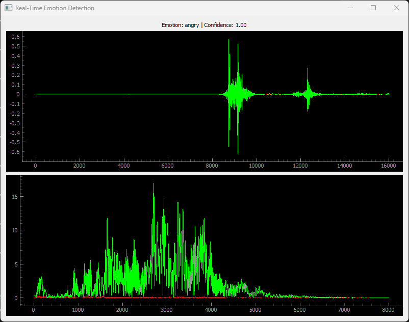

# 🎤 Real-Time Emotion Detection from Audio

This project performs **real-time emotion detection** from audio input using a **trained MLP model**, **DeepFilterNet** for noise suppression, and **PyQtGraph** for live waveform and FFT visualization.



It extracts features such as **MFCC**, **chroma**, **mel spectrogram**, **spectral contrast**, and **tonnetz**, scales them, and predicts the emotion with a confidence score.

---

## 🚀 Features
- **Real-time audio capture** with `sounddevice`.
- **Noise suppression** using **DeepFilterNet**.
- **Feature extraction** with `librosa`.
- **MLP-based emotion classification** (pre-trained model).
- **Waveform and FFT visualization** using `PyQtGraph`.
- **Live GUI** built with PyQt5.

---

## 🛠️ Requirements
Install the following Python packages before running the code:

```bash
pip install numpy sounddevice pyqtgraph PyQt5 joblib torch librosa scipy
